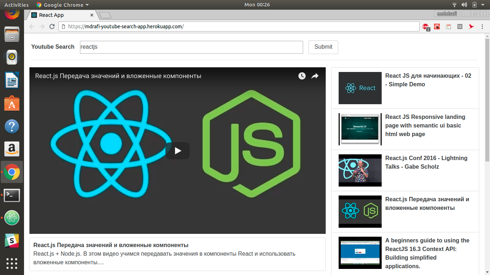

# React-Redux-Youtube-Search-API Web App.
[](https://mdrafi-youtube-search-app.herokuapp.com/)
### >>> [Click Here For Demo.](https://mdrafi-youtube-search-app.herokuapp.com/) <<<
[](https://mdrafi-youtube-search-app.herokuapp.com/)
### Getting Started
>There are two methods for getting started with this repo.
#### Familiar with Git?  
> follow this steps to clone this repository using git.
```sh
$ git clone https://github.com/MohdRafiUddin/React-Redux-Youtube-Search-API.git
$ cd React-Redux-Youtube-Search-API
```
#### Not Familiar with Git?
> Click [here](https://github.com/MohdRafiUddin/React-Redux-Youtube-Search-API/archive/master.zip) then download the .zip file. Extract the contents of the zip file, then open your terminal, change to the project directory, and:
